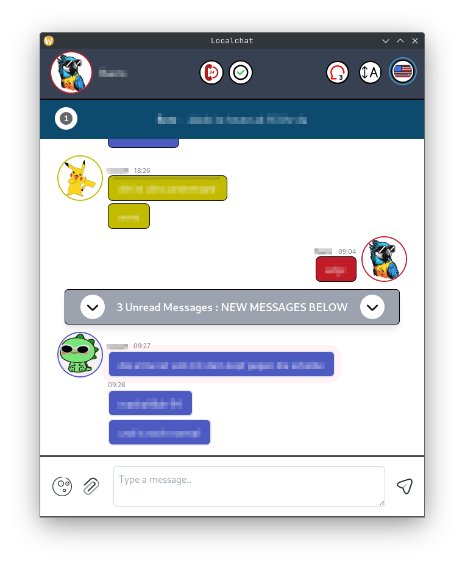

# localchat


## About

Why Another Chat App?
I work with sensitive data that requires strict privacy measures. I need to communicate within a local network and ensure that no network requests go to external servers and no messages are stored on external servers.

localchat is the client part of my little chat application.

## Features
- group chat with multiple clients
- typing indicators
- reactions
- banners
- emergency chat
clients are able to request help via the emergency chat. clients marked as available will receive a notification, whilst unavailable clients will not; hence those clients will not be disturbed. the chat will prompt the helping users to help. these messages will not be persisted
- profile picture caching
- do not disturb mode
- emoji picker and emoji reactions

## Technologies
- Wails (Javascript Framework on top of Golang)
- React via Vite
- Tailwind
- Storybook
- Zustand
- Vitest
- SQLite (Cache)

## Usage
download golang and wails

```bash
go install github.com/wailsapp/wails/v2/cmd/wails@latest
```

```bash
wails build
sudo chmod +x ./build/bin/localchat
./build/bin/localchat
```
## Screenshots


## License

This project is licensed under the MIT License - see the [LICENSE](LICENSE) file for details
