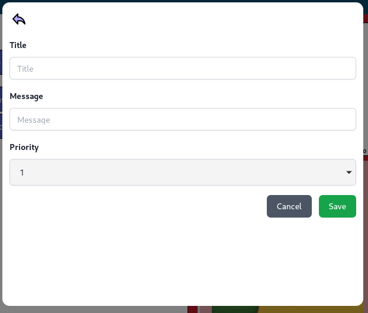
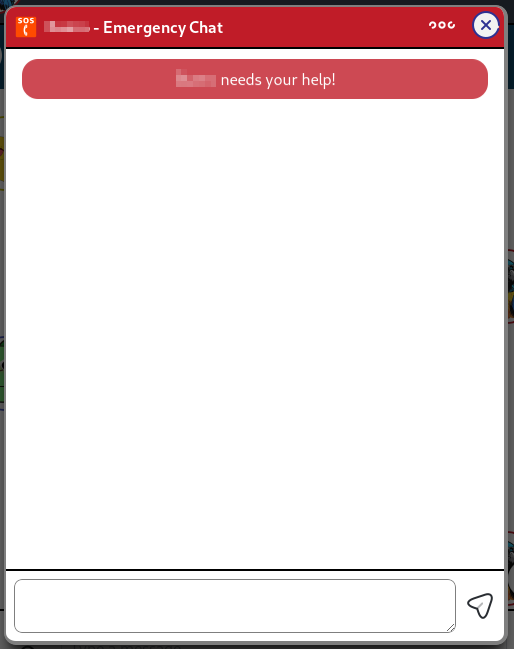
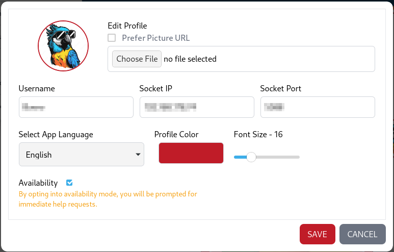

# localchat


## About

##### Why Another Chat App?

I work with sensitive data that requires strict privacy measures. I need to communicate within a local network and ensure that no network requests go to external servers and no messages are stored on external servers.

localchat is the client part of my little chat application.

## Features
- group chat with multiple clients
- typing indicators
- reactions
- banners
- emergency chat
clients are able to request help via the emergency chat. clients marked as available will receive a notification, whilst unavailable clients will not; hence those clients will not be disturbed. the chat will prompt the helping users to help. these messages will not be persisted
- profile picture caching
- do not disturb mode
- emoji picker and emoji reactions

## Technologies
- [Wails](https://wails.io/)
	- Wails is a project that enables you to write desktop apps using Go and web technologies.
- [React](https://react.dev/) via [Vite](https://vitejs.dev/)
- [Tailwind CSS](https://tailwindcss.com/)
- [Storybook](https://storybook.js.org/)
- [Zustand](https://zustand-demo.pmnd.rs/)
- [Vitest](https://vitest.dev/)
- [SQLite](https://www.sqlite.org/index.html)

## Usage
download golang and wails

```bash
go install github.com/wailsapp/wails/v2/cmd/wails@latest
```

```bash
wails build
sudo chmod +x ./build/bin/localchat
./build/bin/localchat
```

or simply use the prebuild binary from github actions

## License

This project is licensed under the MIT License - see the [LICENSE](LICENSE) file for details

## Additional Screenshots

###### Banner




###### Chat Panel


###### Emergency




###### Header


###### Input Area


###### Settings



